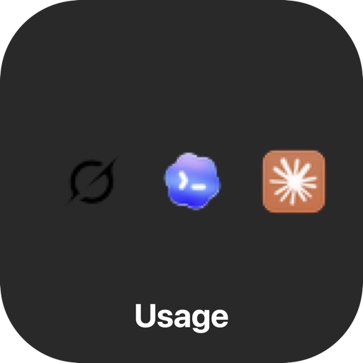

<p align="center">
  
</p>

# Usage Status

A simple macOS menu bar app that shows how much **SuperGrok**, **Codex**, and **Claude** quota you have left.

No terminal needed after install — just icons in your menu bar with percentages.


If this saves you from surprise quota burn, **[star the repo](https://github.com/yurii-lgtm/usage-status)** — it helps others find it.

## Install (easy)

1. Download **[Usage-Status.dmg](https://github.com/yurii-lgtm/usage-status/releases/latest)** from Releases
2. Open the DMG
3. Double-click **`Install Usage Status.command`**
4. Usage icons appear in your menu bar

**First launch:** If macOS says the app is from an unidentified developer, right-click **Usage Status** in Applications → **Open** → **Open** once. Notarized builds (when available) skip this step.

## What you see

| Icon | Shows |
|------|--------|
| Grok | SuperGrok free credits remaining |
| Codex | Codex weekly quota remaining |
| Claude | Claude usage remaining |

Click any icon for details, hide services you do not need, or **Reauthenticate...** to sign in again.

## Sign in to your AI tools

Usage Status reads quota from each provider’s CLI session. Sign in once per tool:

- **Grok:** `grok login` (or Reauthenticate from the Grok menu)
- **Codex:** `codex login`
- **Claude:** `claude auth login`

If you are not signed in, the menu bar shows **—** for that provider. Open its menu and choose **Sign In...** or **Reauthenticate...** — Terminal opens with the provider login command.

## Menu options

Each provider menu includes:

- Current usage and reset time
- **Hide [provider]** — remove that icon from the menu bar
- **Show in Menu Bar** — checkboxes to turn services on/off (available from any visible provider menu)
- **Reauthenticate...**
- **Check for Updates...** — compares your build to the latest [GitHub release](https://github.com/yurii-lgtm/usage-status/releases/latest) and opens the DMG download when a newer version is available
- **Quit Usage Status**

Settings are saved automatically.

## Build from source (developers)

Requirements: macOS 13+, Python 3.12+, Xcode command line tools.

```bash
git clone https://github.com/yurii-lgtm/usage-status.git
cd usage-status
./package.sh
open dist/Usage-Status.dmg
```

Run tests:

```bash
python3 -m unittest discover -v
```

### Sign & notarize (maintainers)

Public releases open without the right-click workaround when signed with a **Developer ID Application** certificate and notarized:

```bash
./package.sh
NOTARIZE=1 \
  APPLE_ID=you@email.com \
  APPLE_APP_PASSWORD=app-specific-password \
  ./package.sh
```

Or run `./scripts/notarize.sh` after `./package.sh`. Without a Developer ID cert, the script signs nothing and prints instructions.

Upload `docs/social-preview.png` in **GitHub → Settings → General → Social preview** for a nicer link card.

## Privacy

- Reads usage from local CLI sessions and provider APIs
- Stores display preferences in `~/Library/Application Support/com.bot.usage-status/`
- No telemetry, no cloud account for Usage Status itself

## License

MIT — see [LICENSE](LICENSE).